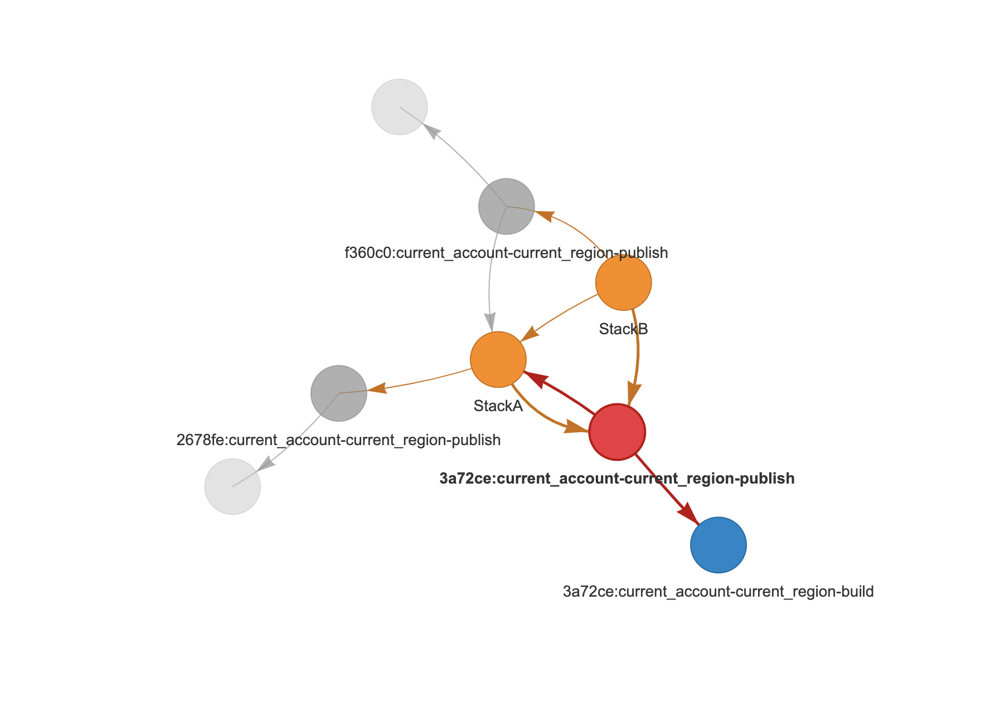

# `cdk deploy` does not run when dependant stacks share assets

Running `cdk deploy` in this repo results CDK exiting after building & publishing assets
without attempting the actual CloudFormation start creation/update.

```shell
$ npm run -- cdk deploy --require-approval=never --all

> cdk-app@0.1.0 cdk
> cdk deploy --require-approval=never --all


✨  Synthesis time: 9.19s

StackA:  start: Building 59d8ff92f2e05057ab76296224335641e49a49de5340ba4eaadc1db1bb98ec13:current_account-current_region
StackA:  success: Built 59d8ff92f2e05057ab76296224335641e49a49de5340ba4eaadc1db1bb98ec13:current_account-current_region
StackA:  start: Building 2c3f6b7194aed42363a8a33f4d46c307e237fef82efea8f1862a5ffd6041529a:current_account-current_region
StackA:  success: Built 2c3f6b7194aed42363a8a33f4d46c307e237fef82efea8f1862a5ffd6041529a:current_account-current_region
StackB:  start: Building 3990b68e52ea41bffd9515f2a18e073b879243875a8b83e1bd658fc056a0ce6f:current_account-current_region
StackB:  success: Built 3990b68e52ea41bffd9515f2a18e073b879243875a8b83e1bd658fc056a0ce6f:current_account-current_region
StackA:  start: Publishing 2c3f6b7194aed42363a8a33f4d46c307e237fef82efea8f1862a5ffd6041529a:current_account-current_region
StackA:  success: Published 2c3f6b7194aed42363a8a33f4d46c307e237fef82efea8f1862a5ffd6041529a:current_account-current_region

# Exit code is 0 despite nothing being deployed.
$ echo $?
0
```

# Versions effected

The bug appears to have been introduced between `v2.76.0` & `v2.80.0` (the version used in the reproduction).

i.e.

```shell
npm run -- cdk --version                            

> cdk-app@0.1.0 cdk
> cdk --version

2.80.0 (build bbdb16a)
```

I suspect the issue was introduced in `v2.80.0` as per [25d5d60](https://github.com/aws/aws-cdk/commit/25d5d60fd0ed852b1817d749b65c68d5279b38a3).

# WorkGraph

Visualizing the string representation of the `WorkGraph` class we see that
there's a circular dependency between `StackA` and the publish step of the
shared artifact.

```
StackA := pending stack (3a72cef490a57e917476cc38c54239b36905a9145dd616ca3aa27f76289c6ab9:current_account-current_region-publish,2678fe7bc8cabbec40a701a87bc751c527801d42499067236a234a6d49fd46af:current_account-current_region-publish)
3a72cef490a57e917476cc38c54239b36905a9145dd616ca3aa27f76289c6ab9:current_account-current_region-build := pending asset-build
3a72cef490a57e917476cc38c54239b36905a9145dd616ca3aa27f76289c6ab9:current_account-current_region-publish := pending asset-publish (3a72cef490a57e917476cc38c54239b36905a9145dd616ca3aa27f76289c6ab9:current_account-current_region-build,StackA)
2678fe7bc8cabbec40a701a87bc751c527801d42499067236a234a6d49fd46af:current_account-current_region-build := pending asset-build
2678fe7bc8cabbec40a701a87bc751c527801d42499067236a234a6d49fd46af:current_account-current_region-publish := pending asset-publish (2678fe7bc8cabbec40a701a87bc751c527801d42499067236a234a6d49fd46af:current_account-current_region-build)
StackB := pending stack (StackA,3a72cef490a57e917476cc38c54239b36905a9145dd616ca3aa27f76289c6ab9:current_account-current_region-publish,f360c023dafc7a0c56111a8b7dee3f8a3e9ec7c69beb27897209cc6dab868aac:current_account-current_region-publish)
f360c023dafc7a0c56111a8b7dee3f8a3e9ec7c69beb27897209cc6dab868aac:current_account-current_region-build := pending asset-build
f360c023dafc7a0c56111a8b7dee3f8a3e9ec7c69beb27897209cc6dab868aac:current_account-current_region-publish := pending asset-publish (f360c023dafc7a0c56111a8b7dee3f8a3e9ec7c69beb27897209cc6dab868aac:current_account-current_region-build,StackA)

```


